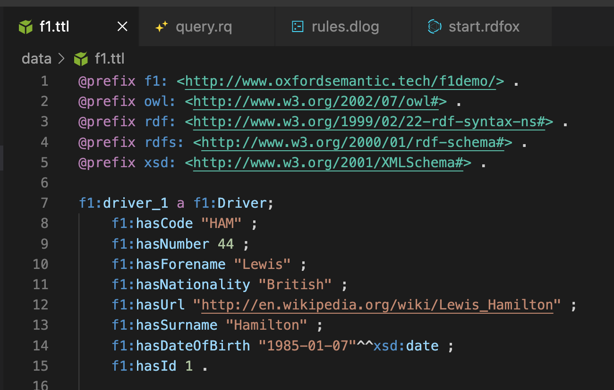

# RDFox Syntax Highlighting

This extension provides syntax highlighting for RDF languages (SPARQL, Turtle, N-Triples and N-Quads), Datalog rules and [RDFox](https://www.oxfordsemantic.tech/product) shell scripts.

It also provides command reference and autocompletion for RDFox shell scripts, as well as function name completion for SPARQL and Datalog files. It includes commands for adding/deleting Datalog rules and opening SPARQL queries in the RDFox Web Console, and adds buttons that execute these commands.

## Features

Supported languages:
- SPARQL (`.rq`, `.sparql`) - with RDFox-specific features
- Datalog (`.dlog`, `.datalog`)
- Turtle (`.ttl`)
- TriG (`.trig`)
- N-Triples (`.nt`)
- N-Quads (`.nq`)
- RDFox Shell Scripts (`.rdfox`)

This VSCode extension will automatically recognize and provide highlighting for the file extensions listed above.

To view the description of an RDFox command, simply hover over it. Autocompletion of RDFox commands or SPARQL & Datalog functions will trigger automatically when you start typing in a file of the relevant type.

Buttons for adding/deleting rules or opening a query in the RDFox Web Console will appear automatically when you open a Datalog or SPARQL file respectively.

## License

MIT, Copyright (c) 2023 Oxford Semantic Technologies (see [LICENSE](https://github.com/OxfordSemantic/vscode-rdfox-rdf/blob/main/LICENSE) file)

The Semantic Web cube logo belongs to W3C (licensing described [here](https://www.w3.org/2007/10/sw-logos.html))
